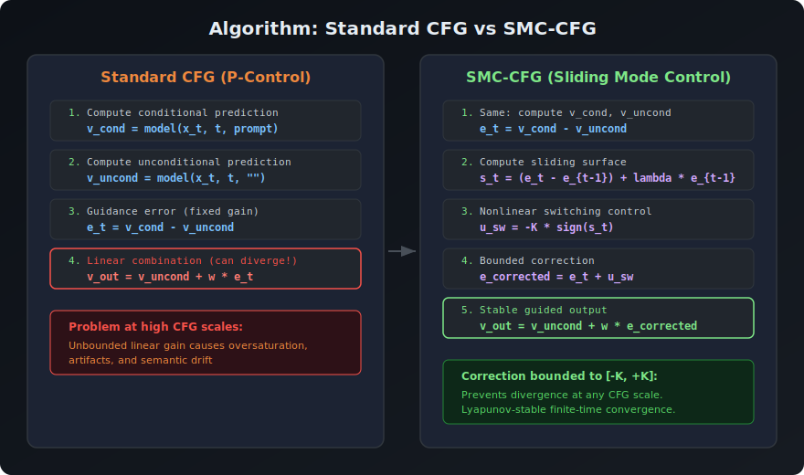
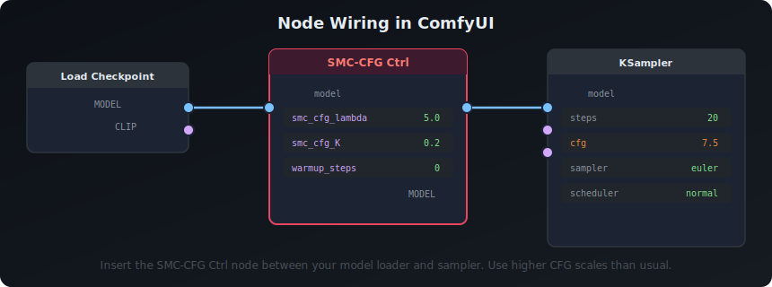
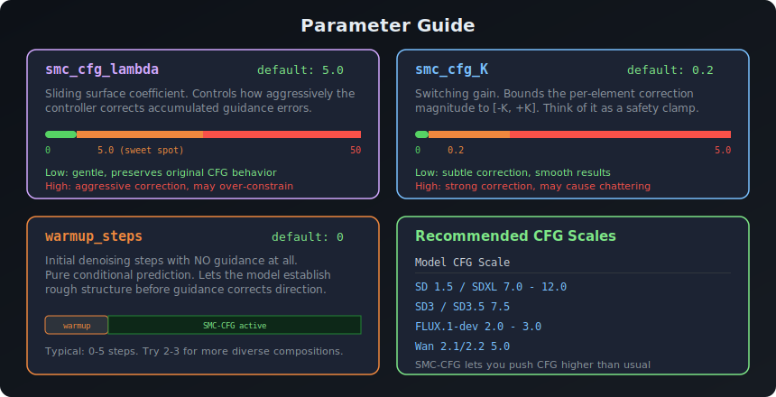

<picture>
  <source media="(prefers-color-scheme: dark)" srcset="assets/banner.svg">
  <source media="(prefers-color-scheme: light)" srcset="assets/banner.svg">
  
</picture>

A ComfyUI node implementing **SMC-CFG** (Sliding Mode Control CFG) from the paper:

> **CFG-Ctrl: A Control-Theoretic Perspective on Classifier-Free Guidance**
> Hang Yang, Shuwei Shi, Changhao Nan, Jingyi Yu, Lan Xu — *CVPR 2026*
> [[Paper]](https://github.com/hanyang-21/CFG-Ctrl) [[Original Code]](https://github.com/hanyang-21/CFG-Ctrl)

Standard CFG uses a fixed linear gain that becomes unstable at high guidance scales — causing oversaturation, artifacts, and semantic drift. This node replaces that linear controller with a **nonlinear sliding mode controller** that keeps guidance stable at any CFG scale.

---

## How It Works

The paper reframes CFG as a control problem. Standard CFG is P-control (proportional control with fixed gain). SMC-CFG adds a bounded nonlinear correction that enforces convergence along an exponential sliding surface.

<picture>
  <source media="(prefers-color-scheme: dark)" srcset="assets/algorithm.svg">
  <source media="(prefers-color-scheme: light)" srcset="assets/algorithm.svg">
  
</picture>

### The math in brief

At each denoising step *t*:

```
e_t  = noise_cond - noise_uncond          # guidance error signal
s_t  = (e_t - e_{t-1}) + λ · e_{t-1}     # sliding surface
u_sw = -K · sign(s_t)                     # switching control (bounded)
e_corrected = e_t + u_sw                  # corrected guidance
v_out = v_uncond + w · e_corrected        # final guided prediction
```

The correction `u_sw` is bounded to `[-K, +K]` per element — this is what prevents the unbounded growth that plagues standard CFG. The sliding surface combines the error derivative with a decayed previous error, creating a feedback loop with Lyapunov-stable convergence.

---

## Installation

### Manual

Clone into your ComfyUI `custom_nodes` directory:

```bash
cd ComfyUI/custom_nodes
git clone https://github.com/ethanfel/ComfyUI-CFG-CTRL.git
```

Restart ComfyUI. No additional dependencies required — the node only uses PyTorch (already in ComfyUI).

---

## Usage

<picture>
  <source media="(prefers-color-scheme: dark)" srcset="assets/node-wiring.svg">
  <source media="(prefers-color-scheme: light)" srcset="assets/node-wiring.svg">
  
</picture>

1. Add the **SMC-CFG Ctrl** node (found in `sampling/custom_sampling`)
2. Connect your model loader's `MODEL` output to the node's `model` input
3. Connect the node's `MODEL` output to your KSampler's `model` input
4. Set your KSampler's CFG scale — you can push it **higher than usual** thanks to the SMC stabilization

That's it. The node patches the model's internal CFG function. It works with **KSampler**, **KSampler Advanced**, and any sampler that respects the model's CFG configuration.

---

## Parameters

<picture>
  <source media="(prefers-color-scheme: dark)" srcset="assets/parameters.svg">
  <source media="(prefers-color-scheme: light)" srcset="assets/parameters.svg">
  
</picture>

### `smc_cfg_lambda` — Sliding Surface Coefficient
**Default: `5.0`** | Range: `0.0 – 50.0`

Controls the sliding surface equation `s_t = (e_t - e_{t-1}) + λ · e_{t-1}`. Higher values weight the previous error magnitude more heavily, making the controller more aggressive about correcting accumulated guidance drift.

| Value | Behavior |
|-------|----------|
| `0.0` | Surface uses only error derivative — very gentle |
| `1.0 – 5.0` | Balanced correction (recommended range) |
| `> 10.0` | Aggressive — may over-constrain the generation |

### `smc_cfg_K` — Switching Gain
**Default: `0.2`** | Range: `0.0 – 5.0`

Bounds the correction to `[-K, +K]` per tensor element. This is the "safety clamp" that prevents instability. Think of it as how hard the controller can push back.

| Value | Behavior |
|-------|----------|
| `0.0` | No correction — equivalent to standard CFG |
| `0.1 – 0.3` | Subtle stabilization (recommended) |
| `> 0.5` | Strong correction — may introduce chattering artifacts |

### `warmup_steps` — No-Guidance Warmup
**Default: `0`** | Range: `0 – 100`

Number of initial denoising steps where guidance is completely disabled (pure conditional prediction). The model establishes rough composition and structure before the SMC controller begins steering.

| Value | Behavior |
|-------|----------|
| `0` | SMC-CFG active from the first step |
| `2 – 5` | Lets structure form first — can improve diversity |
| `> 10` | Long warmup — useful for experimentation |

### Quick Start Settings

For most models, start with the defaults and only adjust if needed:

```
smc_cfg_lambda = 5.0
smc_cfg_K      = 0.2
warmup_steps   = 0
```

These match the paper's recommended values and work well across SD 1.5, SDXL, SD3, FLUX, and Wan models.

---

## Compatibility

- Works with any model that uses CFG (SD 1.5, SDXL, SD3, FLUX, Wan, etc.)
- Compatible with **KSampler**, **KSampler Advanced**, and custom sampling workflows
- Stacks with `sampler_post_cfg_function` nodes (e.g., RescaleCFG can be used alongside)
- **Note:** Replaces the model's CFG function — only one `sampler_cfg_function` node can be active at a time. If another node also sets a custom CFG function, the last one in the chain wins.

---

## Technical Details

### How it integrates with ComfyUI

The node uses `model.clone()` + `set_model_sampler_cfg_function()` — the standard model patching pattern. It intercepts the CFG combination step without modifying model weights, conditioning, or the sampling loop itself.

### State management

The SMC algorithm requires memory of the previous step's guidance error (`e_{t-1}`). This state is held in a closure and automatically resets when a new generation starts (detected via sigma schedule discontinuity).

### Performance

The correction adds only lightweight tensor operations (`sign`, multiply, add) per denoising step. The overhead is negligible compared to the model forward pass. However, `disable_cfg1_optimization=True` is set to ensure both conditional and unconditional predictions are always computed.

---

## Citation

If you use this in your work, please cite the original paper:

```bibtex
@article{yang2025cfg,
  title={CFG-Ctrl: A Control-Theoretic Perspective on Classifier-Free Guidance},
  author={Yang, Hang and Shi, Shuwei and Nan, Changhao and Yu, Jingyi and Xu, Lan},
  journal={arXiv preprint arXiv:2505.18727},
  year={2025}
}
```

---

## License

This ComfyUI node is released under the [Apache 2.0 License](LICENSE), matching the original CFG-Ctrl repository.
